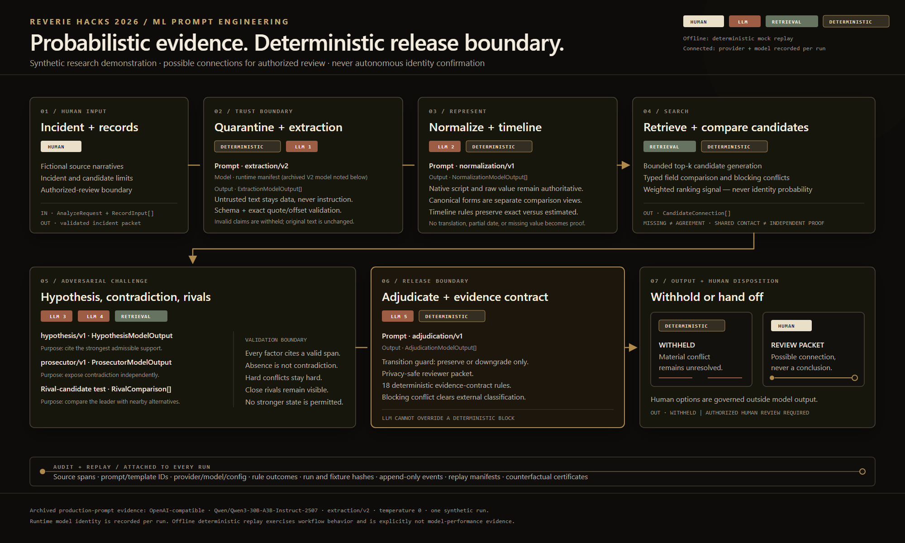

# THREADLINE

**An experimental safety and review layer for proposed connections between fragmented synthetic missing-person records.**

THREADLINE preserves exact provenance, challenges each candidate hypothesis with contradictions and rivals, and deterministically withholds outputs that are not safe for authorized human review. It treats an unsupported connection as the highest-cost failure and never presents record similarity as proof of identity.

## Reverie Hacks 2026 judge start

> **Connect the records. Never guess the person.**

THREADLINE reconnects fragmented synthetic missing-person reports across hospitals, shelters, NGOs, and families. AI extracts source-cited evidence; deterministic safety rules decide when the system must stop.

1. Run `./scripts/run-v1-demo.ps1` — the deterministic path requires no network connection or API key.
2. Open `http://127.0.0.1:3000/demo?demo=guided` and select **Run the evidence case**.
3. Open `http://127.0.0.1:3000/prompt-lab` to compare exact inputs, prompts, outputs, and Prompt V1/V2/V3 promotion evidence.
4. Use the [three-minute script](docs/reverie-demo-script.md) and [judge Q&A](docs/reverie-judge-qa.md).

The guided climax is one supported possible connection prepared for authorized human review and one plausible rival stopped by a deterministic conflict gate. “Connection recovered” describes a candidate record connection—not a person identified.

## The problem

Disaster records arrive incomplete, multilingual, inconsistently formatted, OCR-damaged, and sometimes contradictory. A phone may appear with a domestic or international prefix. One source may contain only a birth year. A native-script name may appear elsewhere as a Latin transliteration. Naive exact matching misses these threads; unconstrained fuzzy matching can merge different people.

## The solution

THREADLINE separates probabilistic extraction from deterministic identity policy:

1. Ingest and quarantine untrusted record text.
2. Extract typed identity evidence tied to exact source spans.
3. Preserve raw evidence while building canonical comparison forms.
4. Retrieve a bounded set of plausible candidate pairs.
5. Compare each field as exact, normalized, compatible, partial, conflicting, missing, or incomparable.
6. Apply explicit conflict blocks, evidence weights, and a fixed `0.35` recommendation threshold.
7. Withhold unsafe output or prepare a possible connection for authorized human review.
8. Retain reason codes, provenance, audit events, replay data, and counterfactual evidence.

## Why it is different

- **Evidence before confidence:** every displayed claim traces to an original quotation and offsets.
- **Multilingual by design:** original scripts remain authoritative; transliteration is an additional comparison view, never a replacement.
- **Partial evidence is typed:** a matching birth year is compatible with a full date, not falsely “exact” and not discarded.
- **Conflict-aware:** government-ID and date-of-birth conflicts can block automatic linkage even when other fields agree.
- **Conservative abstention:** names, locations, shared contacts, and weak attributes cannot independently authorize a merge.
- **Benchmarkable policy:** retrieval, comparison, scoring, conflicts, and decision states are deterministic and shared by the benchmark and API path.

## Architecture



Five schema-constrained stages can use the configured provider: extraction, multilingual normalization, hypothesis construction, contradiction challenge, and adjudication. Quarantine, source-span validation, timeline rules, candidate generation, pairwise comparison, scoring, blocking conflicts, privacy redaction, and the release contract are deterministic. Model-assisted stages may preserve or downgrade a result; they cannot upgrade a deterministic blocking state.

The editable Reverie vector is [docs/reverie-ml-workflow.svg](docs/reverie-ml-workflow.svg). A compact implementation diagram remains at [docs/threadline-workflow.svg](docs/threadline-workflow.svg).

## Safety

THREADLINE proposes record connections for authorized review; it does not autonomously determine a person’s identity.

- Zero observed false merges among 8 evaluated different-identity pairs and zero unsafe under-specified links in the archived Prompt V2 extraction/downstream-policy benchmark. The denominator is small and is not a field-safety guarantee.
- Perfect (`1.000`) blocking-conflict recall in that benchmark.
- Exact and partial DOB semantics preserve precision and block incompatible years.
- Phone comparison handles Unicode digits, punctuation, `+`/`00` prefixes, conservative domestic/international compatibility, extensions, OCR repair provenance, and unsafe suffix cases.
- Transliteration-only name evidence cannot recommend a link.
- Malformed provider output fails closed after one bounded repair attempt.
- Domain-valid certainty aliases are normalized, while unknown labels remain schema errors.
- Review decisions are structured and appended to a tamper-evident audit history.

## Benchmark

THREADLINE keeps its evidence tracks separate. The submission comparison is a fixed-seed deterministic mock harness in which every system receives the same synthetic record packets; it demonstrates workflow behavior and reproducibility, not live-model quality. The archived Phase 11 Prompt V2 artifact below is one live-provider extraction run over 58 synthetic records; it is not a same-model baseline comparison or a claim about field performance. A frozen preregistered live same-model comparison (3 synthetic cases × 3 repetitions × 2 systems = 18 runs, spec `THREADLINE-REVERIE-LIVE-EVAL-V1.1`) completed 18/18 runs with mixed outcomes and claims no superiority; its sanitized checkpoint lives under `backend/data/reverie_live_evaluation_v1_1/`.

| Metric | Phase 10T Prompt V1 | Phase 11 Prompt V2 |
|---|---:|---:|
| Extraction success | — | 57 / 58 |
| Micro extraction recall | — | 0.8626 |
| Micro extraction precision | — | 0.8396 |
| Micro extraction F1 | — | 0.8509 |
| Retrieval recall | — | 14 / 14 |
| True links | 3 | 4 |
| False non-links | 11 | 10 |
| False merges | 0 observed | 0 / 8 evaluated different-identity pairs |
| Unsafe links | 0 | 0 |
| Conflict recall | 1.000 | 1.000 |
| Weighted safety score | -35 | -5 |

Prompt V2 improved the separate targeted extraction comparison from `0.8615 → 0.8923` recall, `0.9333 → 0.9667` precision, and `0.8960 → 0.9280` F1. In the archived full run, 57 of 58 records produced schema-valid output; median successful-record latency was `49,714 ms`, nearest-rank p95 was `82,819 ms`, and 236,788 tokens were recorded. API cost was not preserved and is therefore **Not measured**.

An August 2026 full live-provider Prompt V3 trial completed all `58 / 58` extractions and preserved the decision-safety results (4 true links, 0 false merges, 0 unsafe links, `1.000` conflict recall, WSS `-5`). It improved recall to `0.8846` but reduced precision to `0.6736` and F1 to `0.7648`, so it was not promoted. Production deliberately remains on the better-balanced Prompt V2 pending further precision work and repeated trials.

Artifacts:

- `backend/data/live_runs_phase11/full-prompt-v2-run-1/live-artifact.json`
- `backend/data/live_runs_phase11/full-prompt-v2-run-1/raw-outputs.json`
- `backend/data/live_runs_phase13/full-prompt-v3-run-1/live-artifact.json`
- `docs/threadbench-data-card.md`
- `docs/final-validation.md`
- `docs/submission/results.json`
- `docs/submission/results.csv`
- `docs/submission/raw-outputs.json`
- `docs/submission/benchmark-report.md`

## Prior work and scope

THREADLINE does not claim to have invented digital missing-person matching. The [ICRC Missing Persons Digital Matching project](https://www.icrc.org/sites/default/files/media_file/2024-12/MPDM_tool_A4_1%20pager.pdf) already describes multilingual matching, database search, and human analysis of candidate results. THREADLINE's narrower research contribution is exact claim-to-source lineage, adversarial contradiction analysis, retained rivals, prompt-injection containment, deterministic release rules around probabilistic stages, replay, counterfactual evaluation, and safety-weighted synthetic benchmarking.

The design is informed by the ICRC [Handbook on Data Protection in Humanitarian Action](https://www.icrc.org/en/data-protection-humanitarian-action-handbook) and the [revised OCHA Data Responsibility Guidelines](https://centre.humdata.org/revised-ocha-data-responsibility-guidelines/). THREADLINE is not endorsed by either organization and has not been validated for operational humanitarian use.

## Visual direction and provenance

On August 9, 2026, the user explicitly authorized three Higgsfield `gpt_image_2` concept generations at 2K, 16:9: an opening documentary frame, the archive-to-workbench transition, and the safety/abstention scene. The downloaded references are retained under `docs/art-direction/` for provenance and review. They are not in the frontend public asset tree and are never embedded, served, or used as a background-video substitute. The shipped landing experience recreates the direction natively in semantic React, CSS, and SVG. See `docs/threadline-art-direction.md` and `creative/threadline/manifests/generation-manifest.json`.

## Demo

The quickest judge flow uses only synthetic data:

```powershell
./scripts/run-v1-demo.ps1
```

If PowerShell script execution is restricted:

```powershell
powershell.exe -NoProfile -ExecutionPolicy Bypass -File ./scripts/run-v1-demo.ps1
```

Then open:

- `http://127.0.0.1:3000/demo?demo=guided` for the guided evidence case.
- `http://127.0.0.1:3000/prompt-lab` for the same-input prompt and workflow comparison.
- The `passing_workspace` and `blocked_workspace` URLs printed by the script for persisted API-backed cases.
- `http://127.0.0.1:8000/docs` for the live API contract.

The guided case is explicitly fictional. It shows the same three-record packet through a reasonable single-prompt deterministic replay and the full workflow. `FAMILY-018 ↔ SHELTER-204` becomes a traceable possible connection for authorized review; plausible rival `HOSPITAL-052` is stopped by exact age/timeline evidence and a deterministic conflict gate. The replay is visibly labelled **not model performance**.

## Tech stack

- **Backend:** Python 3.11+, FastAPI, Pydantic 2, RapidFuzz, HTTPX, SQLite, pytest, Ruff, mypy.
- **Frontend:** Next.js 16 App Router, React 19, TypeScript, Tailwind CSS 4 plus repository CSS, Node’s test runner, ESLint.
- **Provider interface:** OpenAI-compatible structured-output endpoint or deterministic mock provider.

## Repository structure

```text
backend/
  app/api/            FastAPI routes
  app/prompts/        versioned extraction and workflow prompts
  app/services/       normalization, retrieval, comparison, decisions, audit
  app/workflow/       production orchestration nodes
  fixtures/           synthetic benchmark and canonical identity assignments
  tests/              unit, contract, integration, safety, adversarial tests
frontend/
  src/app/            Next.js routes and global styles
  src/components/     workspace, evidence, review, and evaluation UI
  src/data/           clearly labeled synthetic demo fixtures
docs/                 architecture, safety, evaluation, demo, and submission docs
scripts/              local start, demo, and integration-smoke commands
shared/               stable sample and evaluation artifacts
```

## Running locally

Install backend dependencies:

```powershell
cd backend
py -3.11 -m venv .venv
./.venv/Scripts/python.exe -m pip install -r requirements-dev.txt
cd ..
```

Install frontend dependencies:

```powershell
cd frontend
npm ci
cd ..
```

Start two terminals from the repository root:

```powershell
./scripts/start-backend.ps1
```

```powershell
./scripts/start-frontend.ps1
```

The default mock provider requires no credentials. For a live OpenAI-compatible provider, copy `backend/.env.example` to `backend/.env` and supply credentials locally. Never commit `.env`.

## Tests

The current runtime validation is green: 464 backend tests, the 10-gate deterministic validator, 28 Phase 11 extraction-contract tests, 43 frontend behavior tests, frontend typecheck, a full repository-wide ESLint pass, the production build, both integration-smoke paths, and production browser QA at desktop, tablet, and 390 px.

The repository-wide Ruff and mypy baselines remain known debt (`185` Ruff findings across 17 files and `139` mypy findings across 16 files at the current audit). The commands below are the complete check set, not a claim that those two static-analysis commands are currently green.

```powershell
cd backend
./.venv/Scripts/python.exe -m pytest
./.venv/Scripts/python.exe _phase10s_validate.py
./.venv/Scripts/python.exe -m pytest tests/test_phase11_extraction_contract.py
./.venv/Scripts/python.exe -m ruff check app tests scripts
./.venv/Scripts/python.exe -m mypy app
```

```powershell
cd frontend
npm test
npm run typecheck
npm run lint
npm run build
```

With the backend running:

```powershell
./scripts/integration-smoke.ps1
```

## Limitations

- Evaluation uses synthetic fixtures and one archived full live-provider run for each of Prompt V2 and Prompt V3; it does not establish real-world accuracy or demographic fairness, repeatability, or confidence intervals.
- A phone or email may be shared by a household, and transliteration is inherently ambiguous. THREADLINE therefore requires independent support and routes borderline cases to review.
- The built-in transliteration layer covers selected scripts and common variants, not every language or naming convention.
- Location and distinguishing-mark extraction remain provider-sensitive and require continued precision evaluation.
- Audit hashes reveal mutation of chained event metadata and payloads, but do not prevent database changes or cryptographically seal the current contract/result rows. Production use needs access controls and an external artifact-signing or anchoring boundary.
- Production deployment would require governance, access control, encryption, regional data handling, reviewer training, retention policy, and evaluation on representative authorized datasets.

## Future work

- Validate with consented, representative humanitarian datasets and measure subgroup error rates.
- Add incident-aware country context for phone comparison without unsafe global assumptions.
- Expand deterministic transliteration support and calibrated review tooling.
- Complete repeated live-provider trials and report confidence intervals for extraction and decision drift; the completed 18/18 same-model comparison reports per-repetition results without confidence intervals.

## Submission package

The Reverie ML-track package is indexed by:

- [ML workflow documentation](docs/reverie-ml-track-documentation.md)
- [Editable workflow SVG](docs/reverie-ml-workflow.svg) and [submission PNG](docs/reverie-ml-workflow.png)
- [Prompt comparison report](docs/reverie-prompt-comparison.md)
- [Three-minute demo script](docs/reverie-demo-script.md)
- [Judge Q&A](docs/reverie-judge-qa.md)
- [Submission checklist](docs/reverie-submission-checklist.md)
- [Machine-readable Prompt Lab artifact](docs/submission/reverie-prompt-lab.json)
- [One-page evidence summary](docs/reverie-evidence-summary.md)
- [Release, clean-copy, PDF, and deployment boundary](docs/reverie-release.md)

The authoritative offline release command is `./scripts/reverie-release.ps1` on Windows or `bash scripts/reverie-release.sh` on POSIX systems. Official mode refuses a dirty tree; no public deployment is performed or claimed.

The broader technical narrative and safety statement remain in [docs/hackathon-submission.md](docs/hackathon-submission.md), with locked benchmark evidence under [docs/submission/](docs/submission/README.md).

Licensed under [MIT](LICENSE).
